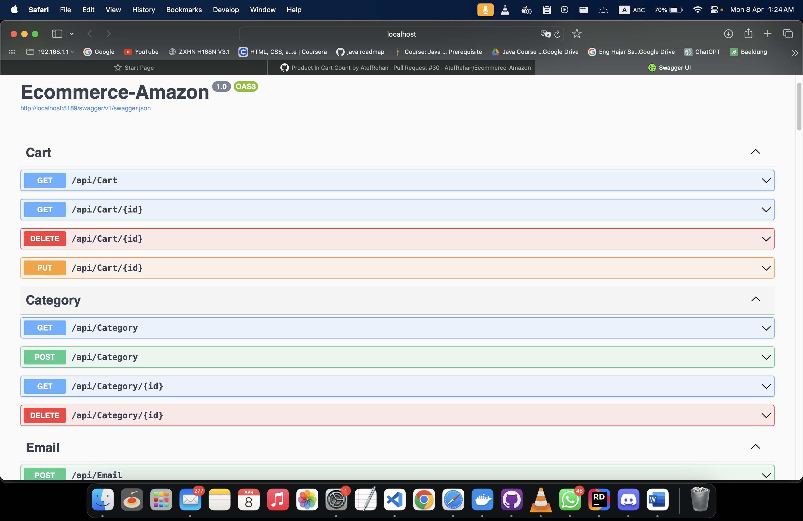
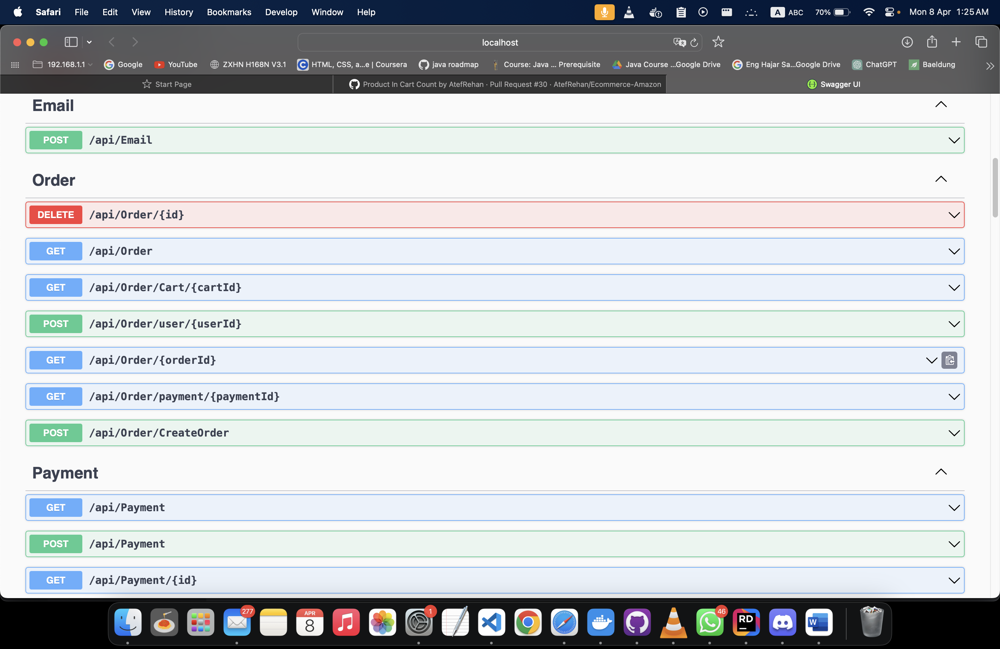

<p align="center"></p>
<h1> <p align="center"> Amazon </p></h1>

Welcome to the comprehensive documentation for the Amazon E-Commerce website, meticulously developed with educational objectives in mind. This documentation offers an in-depth exploration of the captivating features and functionalities of our platform, focusing primarily on product sales and providing users with a seamless online shopping experience.

## Installation:
1. **Clone the Repository:**
    - Clone the Amazon repository to your local machine using the following command:
      ```
      git clone https://github.com/yourusername/Amazon.git
      ```

2. **Navigate to the Project Directory:**
    - Change directory to the cloned Amazon repository:
      ```
      cd Amazon
      ```

3. **Install Dependencies:**
    - Run the following command to install the necessary dependencies:
      ```
      dotnet run
      ```

## Configuration:

### Angular Configurations:

1. **Open Angular Project in VS Code:**
    - Navigate to the root directory of your Angular project using VS Code or any other preferred code editor.

2. **Install Node Modules:**
    - Open a terminal in VS Code and run the following command to install the necessary Node modules:
      ```
      npm install
      ```

3. **Run Angular Server:**
    - After installing the Node modules, start the Angular development server by running the following command:
      ```
      ng serve
      ```
    - This will compile your Angular project and serve it locally. You can access the application in your web browser at `http://localhost:4200`.

### Database Configurations:

1. **Restore the Database:**
    - Restore the database which exists in the repository.

2. **Provide SQL Server Authentication in Local Device:**
    - Configure SQL Server authentication on your local device.

3. **Update SQL Connection String:**
    - Update your suitable SQL connection string in the app settings file to establish a connection with the database.

## File Structure 📦
This file structure represents the organization of our e-commerce website project, built using the Model-View-Controller `MVC` architectural pattern. The MVC pattern separates the application into three main components: `models` (representing the data), `views` (displaying the user interface), and `controllers` (handling user input and interaction).

```
📂 controllers/
│   └── UserController.cs
│   └── ProductController.cs
│   └── OrderController.cs
│   └── ...
📂 data/
│   └── ApplicationDbContext.cs
│   └── SeedData.cs
📂 dtos/
│   └── UserDto.cs
│   └── ProductDto.cs
│   └── OrderDto.cs
│   └── ...
📂 migrations/
│   └── 20220315092523_InitialCreate.cs
│   └── 20220315092523_InitialCreate.Designer.cs
│   └── ...
📂 models/
│   └── User.cs
│   └── Product.cs
│   └── Order.cs
│   └── ...
📂 repositories/
│   ├── IUserRepository.cs
│   ├── IProductRepository.cs
│   ├── IOrderRepository.cs
│   ├── UserRepository.cs
│   ├── ProductRepository.cs
│   ├── OrderRepository.cs
│   └── ...
📂 services/
│   ├── EmailService.cs
│   ├── TokenService.cs
│   └── ...
📄 Program.cs
📄 Startup.cs
📄 appsettings.json
📄 README.md
```

## Features ⚡️
- [x] User Authentication: Allow users to create accounts, log in, and manage their profiles securely.
- [x] Product Catalog: Display a wide range of products organized into categories with detailed descriptions and images.
- [x] Shopping Cart: Allow users to add products to their cart, view cart contents, and proceed to checkout.
- [ ] Secure Payments: Implement secure payment gateways to facilitate safe transactions for purchases.
- [x] Order: Provide users with updates on the status of their orders.
- [x] Responsive Design: Ensure the website is optimized for various devices, including desktops, tablets, and smartphones.
- [x] Admin Dashboard: Offer administrators' tools to manage products, orders, users, and other aspects of the platform.
- [x] Wishlist: Enable users to save products for future purchase consideration.
- [x] Guest Checkout: Enable users to make purchases without creating an account, streamlining the checkout process.
- [ ] Order History: Provide users with access to their complete order history, including past purchases, order statuses, and receipts.
- [x] Product Availability: Allow users to know if the products are available or not.
- [ ] Notifications: Out-of-stock products and receive alerts when they become available






## Dependencies


Read [The Fastest NuGet Package Ever Published (Probably)](https://rehansaeed.com/the-fastest-nuget-package-ever-published-probably/) for a full walk through guide with screenshots on how you can create a brand new project using this template and get a NuGet package published in a couple of minutes.

This project template leverages `dotnet new`, a command-line interface tool, to enable you to customize the features of the project template. You can easily turn on or off specific features according to your requirements.


This project template comes with the following dependencies:

- `Microsoft.AspNetCore.Authentication.JwtBearer`: Library for JSON Web Token (JWT) authentication in ASP.NET Core.
- `Microsoft.AspNetCore.Identity.EntityFrameworkCore`: Library for ASP.NET Core Identity with Entity Framework Core integration.
- `Microsoft.EntityFrameworkCore.SqlServer`: Entity Framework Core provider for SQL Server databases.
- `Microsoft.EntityFrameworkCore.Tools`: Additional tools for Entity Framework Core migrations and commands.
- `Microsoft.VisualStudio.Web.CodeGeneration.Design`: Design-time support for ASP.NET Core code generation.
- `AutoMapper`: A library for object-to-object mapping.
- `MailKit`: A library for working with email messages.
- `Swashbuckle.AspNetCore`: A library for generating Swagger/OpenAPI documentation for ASP.NET Core APIs.


<h2><p align="center">🔥 API Documentation 🔥</p></h2>

**Below, you'll find a simple preview of the APIs available:**

### `GET` /api/Category
```js
fetch('http://localhost:5189/api/Category', options)
  .then(response => response.json())
  .then(response => console.log(response))
  .catch(err => console.error(err));
```
**Output >>**
```json
{
  "categoryId": 1,
  "categoryName": "Clothes",
  "subCategories": [
    {
      "subCategoryId": 1,
      "subCategoryName": "Women"
    },
    {
      "subCategoryId": 2,
      "subCategoryName": "Men"
    },
    {
      "subCategoryId": 3,
      "subCategoryName": "Children"
    }
  ]
}
```

### `GET` /api/Order/Cart/{id}
```js
fetch('http://localhost:5189/api/Order/Cart/4', options)
  .then(response => response.json())
  .then(response => console.log(response))
  .catch(err => console.error(err));
```
**Output >>**
```json
{
   "orderId": 4,
   "createdAt": "2024-02-02T00:00:00",
   "shippingDate": "2024-04-04T00:00:00",
   "total": 1800,
   "isCancelled": false,
   "applicationUserId": "a036d3f8-8ba4-4889-b5c5-30a227e9ee7c",
   "cardType": "credit",
   "orderProducts": [
      {
         "productId": 14,
         "image": "https://townteam.com/cdn/shop/products/JAC23WFWP28375TM1_NAVY-RED-2.jpg?v=1702389728",
         "name": "Jacket",
         "price": 900,
         "quantity": 2,
         "stock": 4
      }
   ]
}
```

### `GET` api/ProductInCart/{id}
```js
fetch('http://localhost:5189/api/ProductInCart/2', options)
  .then(response => response.json())
  .then(response => console.log(response))
  .catch(err => console.error(err));
```
**Output >>**
```json
  {
   "id": 2,
   "product": {
      "productId": 7,
      "name": "Dress",
      "price": 800,
      "stock": 5,
      "image": "https://i.pinimg.com/564x/46/4e/cf/464ecf9ed274f19f8b4eca54e9d79b2c.jpg"
   },
   "quantity": 2
}
```
### `Post` api/ProductInCart

### `Delete` api/ProductInCart/Product/{id}

### `Put` api/Products/{id}


## Contributors  ✈️

<a href="https://github.com/dinaAmmam">  </a>

<a href="https://github.com/MhmdTahaSheRif"> </a>

<a href="https://github.com/AtefRehan"> </a>

<a href="https://github.com/esra-saleh"> </a>

<a href="https://github.com/Mariam-Sameh6"> </a>